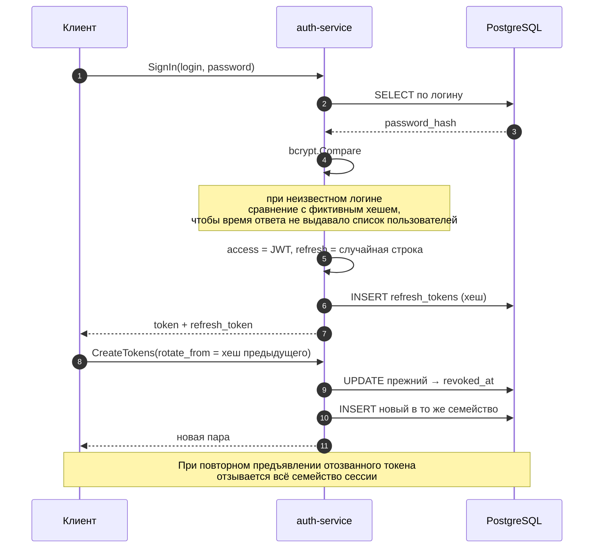

# auth-service

gRPC-сервис авторизации системы видеохостинга. Регистрация, вход, выпуск и
ротация токенов, проверка их подлинности.

Контракт: [grpc-contract](https://github.com/nikaydo/grpc-contract) ·
потребитель: [video-platform](https://github.com/nikaydo/video-platform)

## Что делает

| Метод | Назначение |
|---|---|
| `SignUp` | Регистрация. Пароль хешируется bcrypt до записи в базу |
| `SignIn` | Проверка пароля, выпуск access- и refresh-токенов |
| `CheckUser` | Поиск пользователя по логину, без возврата пароля |
| `CreateTokens` | Выпуск новой пары, с ротацией или без неё |
| `ValidateJWT` | Проверка токена. Истечение срока — `expired = true`, не ошибка |

## Стек

Go 1.24 · gRPC · PostgreSQL 17 (`pgx/v5`) · `golang-jwt` v5 · bcrypt ·
`golang-migrate` · `caarlos0/env` · slog · Docker · GitHub Actions

## Запуск

```bash
git clone https://github.com/nikaydo/auth-service.git
cd auth-service

# 1. Контракт нужен как локальный модуль
git clone --depth 1 https://github.com/nikaydo/grpc-contract.git ../grpc-contract
go mod edit -replace github.com/nikaydo/grpc-contract=../grpc-contract

# 2. Конфигурация
cp .env.example .env
openssl rand -base64 48   # → JWT_SECRET

# 3. Запуск
docker compose up --build
```

Сервис поднимается на `localhost:50051`, миграции применяются при старте.

## Конфигурация

| Переменная | По умолчанию | Назначение |
|---|---|---|
| `DATABASE_URL` | — | Строка подключения к PostgreSQL |
| `JWT_SECRET` | — | Ключ подписи access-токенов, минимум 32 символа |
| `ACCESS_TOKEN_TTL` | `15m` | Срок жизни access-токена |
| `REFRESH_TOKEN_TTL` | `720h` | Срок жизни refresh-токена |
| `JWT_ISSUER` | `video-platform` | Значение claim `iss`, проверяется при разборе |
| `HOST` / `PORT` | `0.0.0.0` / `50051` | Адрес gRPC-сервера |
| `MAX_MESSAGE_BYTES` | `1048576` | Предел размера входящего сообщения |
| `BCRYPT_COST` | `12` | Стоимость bcrypt, допустимо 10–31 |

Конфигурация проверяется при старте: приложение **не запустится** со
значением-заглушкой `CHANGE_ME`, коротким секретом или шаблоном
`DATABASE_URL`. Обрыв конфигурации обнаруживается при старте, а не при
первом обращении к базе.

## Устройство хранения токенов

Refresh-токен — **непрозрачная случайная строка** вида `<семейство>.<секрет>`,
а не JWT. В базе лежит только её SHA-256 хеш.



Почему так:

- **Непрозрачный, а не JWT.** У него нет утверждений, которые нужно проверять, поэтому подписывать нечего. Единственный способ его принять — найти запись по хешу. Энтропии 256 бит хватает, чтобы перебор был невозможен, поэтому медленный KDF не нужен.
- **Хеш, а не токен.** Утечка базы не даёт войти под пользователем: токен ещё нужно предъявить.
- **Семейство токенов.** Все токены одной сессии связаны `family_id`. Повторное предъявление отозванного токена означает утечку, поэтому отзывается всё семейство.
- **Ротация без перезаписи.** Прежний токен помечается отозванным, новый добавляется отдельной записью. Если бы хеш перезаписывался, старый перестал бы существовать и повторное использование стало бы неотличимым от предъявления несуществующего токена.

## Решения и их цена

### Пароли

bcrypt со стоимостью 12. В исходной версии пароль писался в базу открытым
текстом и сравнивался прямо в SQL: `WHERE login = $1 AND password = $2`.

При входе с несуществующим логином выполняется сравнение с фиктивным хешем —
иначе такой запрос возвращался бы заметно быстрее и по времени можно было бы
перебирать существующие учётные записи.

*Цена:* около 250 мс на регистрацию и вход. Это осознанный размен: медленный
хеш делает утечку дорогой в офлайне, а перебор по сети ограничивается
ограничениями на самом шлюзе.

### Идентификатор пользователя

`CreateUser` возвращает значение из `RETURNING id`. Раньше результат вставки
отбрасывался, а метод возвращал константу `1` — все пользователи получали
один идентификатор, и токены разных людей оказывались взаимозаменяемыми.

*Цена:* идентификаторы целочисленные, а не UUID. Это дешевле и компактнее, но
раскрывает порядок регистраций; переход на UUID потребовал бы смены контракта.

### Уникальный идентификатор токена

В claims входит `jti`. Без него два токена, выпущенные в одну секунду для
одного пользователя, получались байт-в-байт одинаковыми: подпись HMAC
детерминирована. Из-за этого отозванный токен и выданный следом «новый»
совпали бы.

*Цена:* 16 байт на токен и лишний вызов генератора случайных чисел.

### Схема в миграциях

`golang-migrate` вместо `CREATE TABLE IF NOT EXISTS` в коде. Кодом нельзя
изменить существующую таблицу и нельзя откатить изменение.

*Цена:* миграции нужно применять перед стартом; в CI и в Docker это
автоматически, при ручном запуске — через `task migr:up`.

### Проверка токена

`ValidateJWT` возвращает `expired = true` вместо ошибки при истечении срока:
вызывающему нужно отличить «просрочено» от «подделано». Раньше это поле
игнорировалось, и просроченный refresh-токен проходил проверку.

*Цена:* решение о приёме просроченного токена принимает шлюз. Если он забудет
проверить поле, защита ослабнет — поэтому проверка покрыта тестом.

## Тесты

```bash
task test              # модульные, с -race
task test:integration  # нужен TEST_DATABASE_URL
task cover             # отчёт о покрытии
```

Интеграционные тесты проверяют, что ротация работает, отозванные токены не
находятся, а каждый пользователь получает свой идентификатор. Без
`TEST_DATABASE_URL` они пропускаются, в CI PostgreSQL поднимается сервисом.

## Ограничения

- Один инстанс без распределённого хранения состояния: отзыв токенов работает только внутри своей базы
- Нет подтверждения адреса почты и восстановления пароля
- Роли не проверяются на сервисе: авторизация по роли — задача шлюза

## Лицензия

MIT — см. [LICENSE](LICENSE).